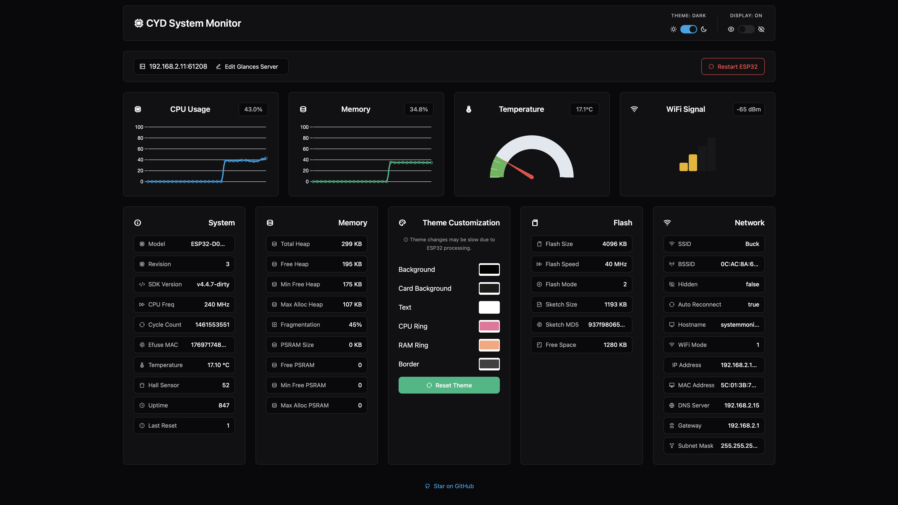

# CYD System Monitor (ESP32 "Cheap Yellow Display")

A sleek system monitoring display powered by ESP32 that shows real-time system metrics from a Glances server. Features a customizable UI with dark/light theme support using LVGL graphics library and power-saving display controls.


## Features

- Real-time monitoring of:
  - CPU usage with core count and load average
  - RAM utilization with total capacity
  - Disk array usage percentage
  - Cache usage percentage
  - System temperature with color-coded warnings
  - Network traffic (upload/download) with auto-scaling units (B/KB/MB)
  - System load
  - Uptime

- Web interface for configuration:
  - Real-time theme customization
  - System statistics dashboard
  - Glances server configuration
  - Device control and monitoring
  - Display power management



- Home Assistant integration:
  - REST API endpoints
  - Device status monitoring & control
  - Remote theme control

## Requirements

- ESP32 development board
- TFT display compatible with TFT_eSPI library
  - I'm using this cheap yellow display with ESP32 built in: [aliexpress](https://s.click.aliexpress.com/e/_olrdG2w)
  - The settings in this project are for this display.
- Glances server running on the target system

## Setup

1. Clone this repository
2. Open the project in PlatformIO

   - Rename the `platformio.example.ini` file to `platformio.ini`
   - Edit the `platformio.ini` file to set the correct path to your Arduino libraries

3. Configure your TFT display settings:
   - Modify TFT_eSPI settings according to your display's configuration
   - Adjust screen resolution in config.h if needed:

   ```cpp

   extern const uint16_t screenWidth = 240;
   extern const uint16_t screenHeight = 320;

   ```

4. Configure your network settings in credentials.example.h:

   - Rename the file to `credentials.h`
   - Edit the file to set your WiFi SSID and password

   ```cpp

    const char*const WIFI_SSID = "your_ssid_here";
    const char* const WIFI_PASSWORD = "your_password_here";

   ```

5. Build and upload the project using PlatformIO

6. Set up your Glances server configuration in the web interface:

   - Access the web interface at the device's IP address
   - Configure the Glances server IP address and port
   - Choose theme colors if you want to change them
   - Save the configuration

### Web Interface

The device hosts a web interface for configuration, accessible at its IP address. Features include:

- Theme switching (dark/light)
- Color customization
- System statistics
- Device restart
- Theme reset

### Home Assistant Integration

The device exposes REST API endpoints for Home Assistant integration:

- GET `/api/status` - Device status and metrics
- POST `/api/command` - Control endpoints for theme switching and device restart

#### Easy Integration

A complete Home Assistant configuration example is provided in [homeassistant_example.yml](homeassistant_example.yml). This includes:

- System sensors (temperature, memory, WiFi signal, uptime)
- Binary sensors for dark mode and display state
- Switches for controlling dark mode and display power
- Commands for device restart and theme reset

Simply copy the configuration, replace `YOUR.DEVICE.IP.HERE` with your device's IP address, and add it to your Home Assistant configuration.
You should see the entities show up in home assistant after a restart.

## API Endpoints

### Web Interface Endpoints

- GET `/settings` - Returns:
  - Current device settings and theme colors
  - System metrics (CPU, memory, temperature)
  - Network information
  - Device information (chip model, SDK version, etc.)
  - Hardware statistics (heap, PSRAM, flash)

- POST `/settings` - Update device settings:
  - Theme colors
  - Dark/light mode
  - Glances server configuration

- POST `/restart` - Restart device
- POST `/resetTheme` - Reset theme to defaults
- POST `/displaySleep` - Control display power state:

  ```json
  {
    "sleep": true|false
  }
  ```

### Home Assistant Endpoints

- GET `/api/status` - Returns:
  - Temperature
  - Free heap memory
  - WiFi signal strength
  - Uptime
  - Dark mode state
  - Display state

- POST `/api/command` - Control endpoints for:
  - Theme switching (`dark_mode`: true|false)
  - Display power (`display`: true|false)
  - Device restart (`restart`: true)
  - Theme reset (`reset_theme`: true)

## Contributing

Feel free to submit issues, fork the repository, and create pull requests for any improvements.
